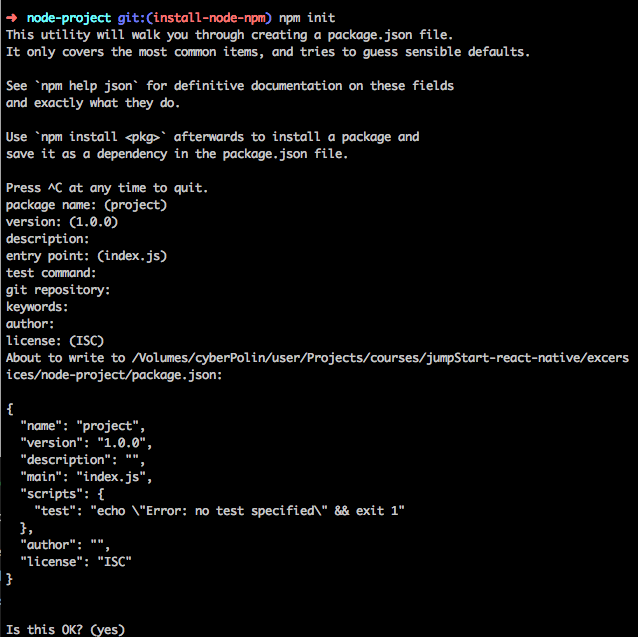

# Instalando Node y Npm

Node es basicamente una implementacion de Javascript del lado del servidor. Tradicionalmente Javascript corre sobre el navegador, pero Node nos permite ejecutarlo como un comando de un servidor o tu equipo, de esta manera podremos usar javascript para hacer procesos en el equipo.

React native usa node como servidor de archivos y para poder corre react-native hay que instalarlo.

Nosotros solo usaremos `nvm install v10` lo que instalara la version 10.16.0 que a la fecha es la mas estable. Una ves hecho esto la definiremos como la default para nuestro uso. `nvm alias default v10.16.0`

Ahora solo verifiquemos que sea la ultima version la que estamos usando. `node -v`
Y revisemos que npm este instalado correctamente. `npm -v` Nos debe dar la version 6.9.0

## npm

NPM es una herramienta para manejar paquetes en un projecto de Node.

## Iniciemos un projecto en Node con `npm init`, esto creara un projecto con la siguiente estructura:

```
mkdir node-project
cd node-project
npm init
```


Por el momento demos 'enter' a todo lo que se nos pregunte...



Con esto hemos creado nuestro primer projecto de Node y npm ha creado un archivo package.json con los siguiente...

```
{
  "name": "project",
  "version": "1.0.0",
  "description": "",
  "main": "index.js",
  "scripts": {
    "test": "echo \"Error: no test specified\" && exit 1"
  },
  "author": "",
  "license": "ISC"
}

```
Como podemos ver hay una llave llamada "main" que se va a ejecutar si corremos `npm start` asi que necesitamos crear un archivo "index.js", comencemos con el y hagamos que logee un hola mundo.

`touch index.js`

```js
console.log('Hola mundo!')
```