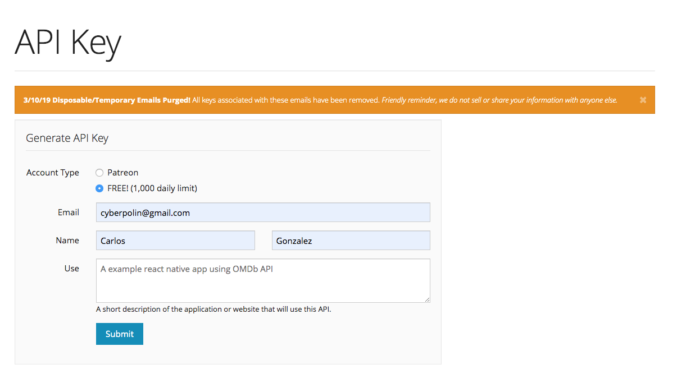

# What is OMDb?

Open Movie Data base es un servicio que provee de informacion acerca del mundo de las peliculas holywoodenses, y lo hace en un esquema abierto, lo que beneficia su consumo y es de gran ayuda para este ejemplo.

## Obteniendo el API Key

  Lo primero que vamos a hacer es abir la url [http://www.omdbapi.com](http://www.omdbapi.com) y buscar la liga  a "API Key", esto nos llevara a una ventana en la cual hay que ingresar un correo al cual nos llegara un link de verificación.

  

  Una ves verificado podremos usar nuestra llave para OMDb API

## Lee la documentación

Aunque en general las API's son faciles de usar, siempre es una buena idea leer la documentacion antes de comenzar, en el caso especifico de nuestra app utilizaremos solo 2 llamados, uno para obtener la lista de peliculas basado en ano y nombre.

